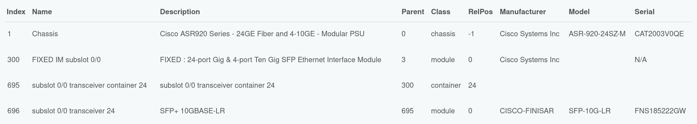
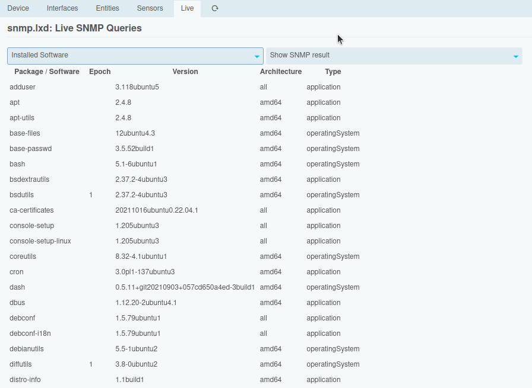
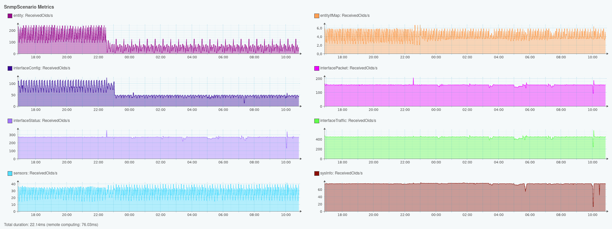
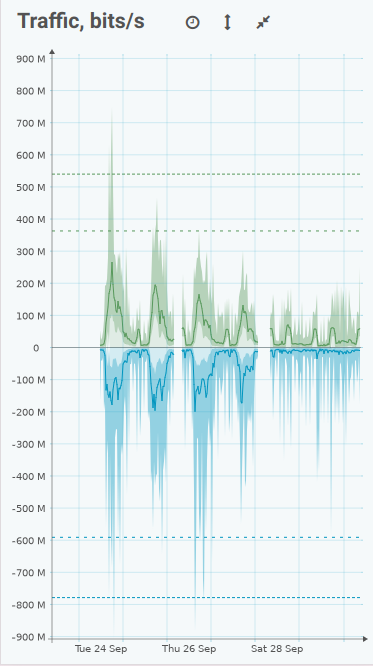
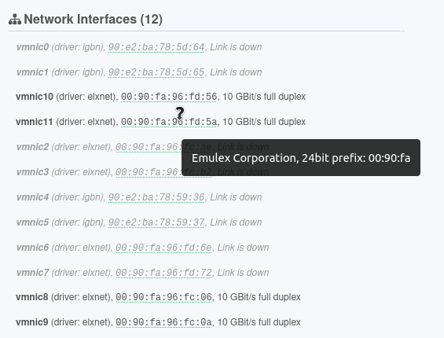

Welcome to IMEdge - Monitoring on the Edge
==========================================

The IMEdge namespace ships a bunch of powerful components for your Open Source Monitoring environment.
As in Edge Computing best practices, this brings processing closer to the data source. The project is
currently in the making, please expect further details soon.

While this has been designed and built as an extension to the [Icinga](https://icinga.com) ecosystem,
it currently is not an official Icinga project. After some back and forth, with naming issues hindering
development, we opted for a white label approach. Still, IMEdge is an unofficial shortcut for **Icinga
Monitoring Edge**. Many thanks go to our main development sponsor [Würth Phoenix](https://www.wuerth-phoenix.com/de/produkt/unified-monitoring/),
for allowing us to finally realize something we dreamed of for a long time.

> [!CAUTION]
> We're currently working hard to get a first public alpha release ready. Installation instructions
> will follow as soon as we got our main core components ready, please stay tuned. Developers: Some of
> these libraries are highly opinionated, others are very generic. We'll ship related documentation for
> the generic ones, as they might be useful in other projects too.

A little preview to get your mouth watering
-------------------------------------------

We created and presented a proof of concept in 2023, a first usable public alpha version in 2024, and
this project is going to shine in 2025. This document is being updated at irregular intervals, shows what has already been
built, and where we're heading to.

### Administrative Oversight

Enabling the IMEdge Web Module enhances the Icinga Web UI in various ways. As an administrator, you'll
obviously be able to inspect your IMEdge nodes health, and you're provided with shortcuts for the most
used remote operations. You can restart nodes, deal with their features, start or stop network listeners
and establish encrypted connections to new nodes.

For those who want more: you're being granted full access to all local and remote RPC methods, directly
from the Web UI. You can sign certificates, create, tweak and delete remote metric stores, or execute
a specific graphing instruction on a sub-process running on a remote node.

### Inventory

The Inventory is where everything is being tied together. IMEdge is a distributed platform, Metrics
and more are being stored and processed on remoted nodes. Still, configuration data is structured,
normalized and stored in a central relational database. When you're for example looking at some
interface traffic graph, the central node knows where to find the data. However, the number crunching
and rendering happens on that remote node.

You'll reach the various parts of your Inventory via a (constantly growing) central Navigation
Dashboard. From here you manage your Credentials, Devices, Sites and more.

When manually adding devices, you assign them to a specific edge node, and pick its lifecycle
and environment. Those properties are meant to deal with certain everyday-conditions in a meaningful
way, without having to fiddle around with tons of flags and settings.

Your device will be enriched with vendor information, and when using public IPs, a nice flag gives
a first idea about where to find this device. All this context information is being fetched from
your local database. You'll find some more related details in the "Data" chapter below.

The inventory also provides a bunch of visualization tools, we created some very useful and informative
widgets:

A rendered network port will show its utilization with its background color, and its LEDs have a
meaning. They can show, whether a port is running in half-duplex mode, and whether Spanning Tree
has disabled the port. A port which is down has a black background and red pins, but if it is
administratively down (which is usually fine), it is just gray.

But there is not only RJ45, we implemented all known registered jacks (4P4C, 6P2C, 6P4C, 6P6C),
CFP (2/4/8) cages, OSFP, QSFP, SFP and XFP - more to come.

In case your device provides them, the Inventory not only contains sensor data, but it also
learns how your devices entities are structured and nested:

Currently, we synchronize also remote sensor values to the central database, but we might decide
to stop doing so, once we implemented related health checks.

Device entities however will always remain part of the Inventory.

Of course the Inventory also contains lots of information related to your network interfaces,
their current state, STP information and more:

In case you're wondering where those metrics/graphs are coming from: please check the Metrics
section below.

### Active SNMP monitoring

Even when adding 1000 devices at once, within less than 10 seconds you'll be shown first details
and reachability information. The device is being inventoried, and all fitting monitoring scenarios
will be applied. There will be options to customize things in the future, but right now we are
focussing on a very simple idea: we want you to forget about a device, once you activated it. No
need to tweak hundreds of knobs, it will just work.

For your device, many periodic scenarios will run in parallel, and with different schedules. You
should normally not need to care about them. Inventarisation tasks kick off early, but are being
triggered regularly at a slower pace. Interface traffic is being fetched every 15 seconds, for all
of your interfaces, error counters, interface state and packet type statistics only every 60 seconds.

Interface configuration is being polled only every 10 minutes, but it's being triggered immediately
(with an intentional delay) in case your device has rebooted.

These are just a few examples, there is much more to this. You'll get a carefully tuned system,
that should fit all kinds of environments, from your small home-lab up to large corporations, being
distributed over multiple continents. A lot of love has been dedicated to many, many details - based
on decades of network monitoring experience.

### Interactive SNMP Scenarios

While period scenarios are usually fully automated, there are still a lot of things you can
accomplish in an interactive way. There are many predefined SNMP scenarios, which can be
triggered on-demand, like fetching information about the installed software:

Of course this is something we plan to synchronise to the DB sooner or later, so there might then
no longer be a need for this. Currently running processes are a much better example of something
one might want to fetch on demand:

The BGP scenario is a good example of how we work when implementing new SNMP-based features. First
we implement a related SNMP scenario, which can immediately be used in an interactive way:

In this example it is already being enriched with context information (Autonomous System
names) from your DB. Next will be synchronizing peer configurations to the Inventory, same
for the peering state - and we'll tag interesting counters for regular polling.

No need to do any manual configuration: as soon as we completed this task, you'll see historic
BGP message counters for all your peerings.

### SNMPv3

We implemented and tested all official and also all well-known vendor-specific authentication
and privacy (encryption) methods:

#### Authentication Methods

* MD5: required in [RFC 3414](https://datatracker.ietf.org/doc/html/rfc3414)
* SHA (SHA1): optional in [RFC 3414](https://datatracker.ietf.org/doc/html/rfc3414)
* SHA-224: optional in [RFC 7860](https://datatracker.ietf.org/doc/html/rfc7860) with 128bit HMAC
* SHA-256: required in [RFC 7860](https://datatracker.ietf.org/doc/html/rfc7860) with 192bit HMAC
* SHA-384: optional in [RFC 7860](https://datatracker.ietf.org/doc/html/rfc7860) with 256bit HMAC
* SHA-512: suggested in [RFC 7860](https://datatracker.ietf.org/doc/html/rfc7860) with 384bit HMAC

#### Privacy / Encryption Methods

* DES: in CBC mode, defined in [RFC 3414](https://datatracker.ietf.org/doc/html/rfc3414)
* 3-DES: Triple-DES EDE in "Outside" CBC mode, mostly used by Cisco, defined in [draft-reeder-snmpv3-usm-3desede-00](https://datatracker.ietf.org/doc/html/draft-reeder-snmpv3-usm-3desede-00)
* AES-128: in CFB mode, required in [RFC 3826](https://datatracker.ietf.org/doc/html/rfc3826) with "Blumenthal" Key localization
* AES-192: in CFB mode, as of [draft-blumenthal-aes-usm-04](https://datatracker.ietf.org/doc/html/draft-blumenthal-aes-usm-04) with "Blumenthal" Key localization
* AES-192: in CFB mode, "Cisco variant", therefore named AES-192-C, as of [draft-reeder-snmpv3-usm-3desede-00](https://datatracker.ietf.org/doc/html/draft-reeder-snmpv3-usm-3desede-00) with "Reeder" Key localization
* AES-256: in CFB mode, as of [draft-blumenthal-aes-usm-04](https://datatracker.ietf.org/doc/html/draft-blumenthal-aes-usm-04) with "Blumenthal" Key localization
* AES-256: in CFB mode, "Cisco variant", therefore named AES-256-C, as of [draft-reeder-snmpv3-usm-3desede-00](https://datatracker.ietf.org/doc/html/draft-reeder-snmpv3-usm-3desede-00) with "Reeder" Key localization

We're using system-provided MD5/SHA hashing methods, and encryption as provided by OpenSSL.
Everything related to (pre-IV), Key generation and Salt exchange has been implemented from
scratch.

### SNMP MIB Browser

An SNMP MIB Browser makes part of the IMEdge project, and while currently being a standalone
module, it will soon be integrated into the central inventory component. As this summary shows,
we intensively tested it with a lot of valid and not-so-valid MIB files:

Please check its [current repository](https://github.com/Thomas-Gelf/icingaweb2-module-mibs/blob/master/README.md)
for more related screenshots. When combined with IMEdge, it offers some otherwise hidden features,
and allows to interactively walk SNMP devices via remote pollers:

Here another one, showing your walk next to the related MIB tree:

Different colors in the tree highlight different access levels.
Conceptual tables are supported and shown as such:

As you can see, table indizes must not be the very first property in a row.
It's also possible to flip the table orientation:

Values modified between one scan and the next one are being highlighted:

Sometimes values making part of compound table indexes are not directly accessible:

This MIB browser hides such complexity, and happily shows the output table as expected:

### Observability - Internal Metrics

IMEdge does a lot of hard work, and many things in parallel. It's important for us to have a
deep understanding of what is going in internally, and that's why we're exporting many internal
counters in various places.

The screenshot shows just a small excerpt, we're looking at the rate of received OIDs per
scheduled SNMP scenario. This greatly helped us improve our scheduling logic, as having
load distributed evenly is one of our main goals.

Additionally, also some system metrics are being collected from every IMEdge monitoring
node.

### Metrics

Speaking about Metrics, of course it's all about the Metrics, when it goes to Monitoring.
Let's start with the most important ones, when it goes to network monitoring: Interface
traffic:

As you can see, we show not only the average interface usage in the selected period. When
showing aggregated data, peaks (maximum and minimum ones) are still being shown. Next to
the graph, the total amount of traffic is being summarized in a human-readable way, and
the most requested (or configured) percentiles are also available right there.  Right below,
there are packet counters and eventual errors.

All images are interactive, and responsive. You have a large screen? You should benefit
from your devices capabilities. The next screenshot shows a traffic graph in fullscreen,
with dark mode active:

Unfortunately those screenshots are unable to show how fast the image rendering takes
place, because that's very impressive. The timing information on this screenshot shows
what is possible with a simple image, while being looked up in the central database, and
being rendered and fetched from a remote node:

### Mobile Layout - Responsiveness

A lot of effort has been invested into being able to provide you with a very satisfying mobile
experience.

A zoomed fullscreen traffic gives a good experience not only on a large screen, it's a
perfect fit on your mobile device too:

Those dashed lines represent the 95th and 99th percentile in the chosen time period.

### Data: valuable context information

No need for remote lookups, no cloud service: the IMEdge inventory allows you to synchronize
a bunch of public sources into your very own local database. MAC address vendors, GEO data,
IP address lookups, Autonomous Systems and more. All of them with a lot of dedication and
attention to details, as this MAC address context information example page showcases:

Wherever a MAC address is shown, you will be made aware of whether it is a Multicast address,
encoded information like Virtual Router identifiers, the related device vendor - or whether
you're seeing a private/random MAC address.

Our DB schema foresees geographical data in various places, allows to import regions and towns
to your very own DB. Streets and houses are not to be found in your local DB, as that would be
a ton of data. However, geolocation lookup for a given address is available for lookup via a
public or self-hosted OpenStreetMap-based service. Your DB will contain your configured addresses
with their corresponding geolocation.

### Integrations

#### Icinga Director Import Source

#### Context information for Icinga modules

The IMEdge Inventory carries a lot of valuable information, and we want to make this
available to other Icinga modules too. As a first sample integration we allowed vSphereDB
to make use of our MAC address / vendor lookup. As a result of this, it's network section
is now also able to provide context information like we've seen above:

Same goes true not only for VMware hosts, but also for Virtual Machines:

#### Metrics for Icinga

Is the Metrics Feature for IMEdge features only? Of course not, we're shipping an Icinga
PerfData writer and an implementation of the Icinga Web Grapher Hook:

Sneak Peek: upcoming features
-----------------------------
### Microsoft Teams integration

While we're not a big fan of closed and cloud only software, this doesn't mean
that we won't talk with them. Half a year ago, we implemented a pretty powerful
working prototype of an MS Teams integration, so this might be one of the features
we're going to lift, once we got our problem handling logic straight.

While the error message on this notification is obviously fake, the rest of it is
real. This notification has successfully been sent to MS Teams, and provided some
interactive controls, that could be used via Teams.

### Interactive Template Editor

Not a high priority, as we ship fitting templates for all SNMP scenarios that are
currently available. However, we already worked on this - and sooner or later it
will be a thing:

Related Repositories
====================

Below you can find a list of all GitHub repositories developed for the IMEdge project,
and their current state.

### IMEdge Node

IMEdge Node is the core project, and ships our working horse, the background daemon.

| Project                                                                    | Packagist / Version                                                                                  |
|----------------------------------------------------------------------------|------------------------------------------------------------------------------------------------------|
| [IMEdge Node](https://github.com/im-edge/node) The IMEdge node daemon |  |

### Node Features

IMEdge node core features and examples for custom addon features.

| Feature                                                                                                  | Packagist / Version                                                                                                            |
|----------------------------------------------------------------------------------------------------------|--------------------------------------------------------------------------------------------------------------------------------|
| [Inventory](https://github.com/im-edge/inventory-feature) Our central (DB) inventory adapter        |  |
| [Metrics](https://github.com/im-edge/metrics-feature) Metrics feature                               |      |
| [Snmp](https://github.com/im-edge/snmp-feature) SNMP feature                                        |      |
| [Ssh](https://github.com/im-edge/ssh-feature) SSH key scan feature, might be used be related checks |              |
| [Tcp](https://github.com/im-edge/tcp-feature) provides TCP checks, sample feature                   |              |

### Icinga Web Module

This module provides the IMEdge module for Icinga Web 2. Currently, this module
allows to control local and remote IMEdge nodes, is proxying graph requests,
and provides access to our inventory database.

| Project                                                                                         | Packagist / Version                                                                                                                          |
|-------------------------------------------------------------------------------------------------|----------------------------------------------------------------------------------------------------------------------------------------------|
| [IMEdge Web](https://github.com/im-edge/icingaweb2-module-imedge)  module for Icinga Web 2 |  |

### Node Libraries

Libraries developed for IMEdge Node and it's features.

| Library                                                                                                             | Coding Standards (PSR12)                                                                                                                                                                             | Unit Tests                                                                                                                                                                              | Static Analysis                                                              | Version (Packagist)                                                                                                         |
|---------------------------------------------------------------------------------------------------------------------|-----------------------------------------------------------------------------------------------------------------------------------------------------------------------------------------------------------|-----------------------------------------------------------------------------------------------------------------------------------------------------------------------------------------|--------------------------------------------------------------------------------------------------------------------------------------------------------------------------------------------------------|----------------------------------------------------------------------------------------------------------------------------------|
| [Async](https://github.com/im-edge/async) helpers for asynchronous code                                        |                            |                            |                            |                            |
| [CertificateStore](https://github.com/im-edge/certificate-store) CA, Trust Store, Client certificate store     |    |    |    |    |
| [CliScreen](https://github.com/im-edge/cli-screen) simple CLI screen abstraction                               |                  |                  |                  |                  |
| [DistanceRouter](https://github.com/im-edge/distance-router) Distance-vector-based Router                      |        |        |        |        |
| [DbMigration](https://github.com/im-edge/db-migration) Opionionated DB migration helper                        |              |              |              |              |
| [Filesystem](https://github.com/im-edge/filesystem) filesystem helpers                                         |                  |                  |                  |                  |
| [IcingaPerfData](https://github.com/im-edge/icinga-perf-data) Icinga PerfData parser                           |      |      |      |      |
| [InfluxDbStreamer](https://github.com/im-edge/influxdb-streamer) optional opinionated InfluxDB writer          |    |    |    |    |
| [Inventory](https://github.com/im-edge/inventory) mostly contracts and DTOs related to our central DB          |                    |                    |                    |                    |
| [JsonRPC](https://github.com/im-edge/jsonrpc) asynchronous JSON-RPC implementation                             |                        |                        |                        |                        |
| [Log](https://github.com/im-edge/log) log utilities                                                            |                                |                                |                                |                                |
| [Metrics](https://github.com/im-edge/metrics) mostly contracts and DTOs related to performance metrics         |                        |                        |                        |                        |
| [ProcessRunner](https://github.com/im-edge/process-runner) deals with starting/stopping related processes      |          |          |          |          |
| [Protocol/NetString](https://github.com/im-edge/protocol-netstring) NetString protocol implementation          |  |  |  |  |
| [Protocol/Ntp](https://github.com/im-edge/protocol-ntp) (S)NTP protocol implementation                         |              |              |              |              |
| [RedisRunner](https://github.com/im-edge/redis-runner) configures and runs dedicated Redis/ValKey instances    |              |              |              |              |
| [RedisTables](https://github.com/im-edge/redis-tables) LUA/Redis-based abstraction for our remote data sync    |              |              |              |              |
| [RedisUtils](https://github.com/im-edge/redis-utils) tooling related to Redis/ValKey                           |                |                |                |                |
| [RpcApi](https://github.com/im-edge/rpc-api) metadata inspection, allowing us to easily export new API methods |                        |                        |                        |                        |
| [RrdCached](https://github.com/im-edge/rrdcached) RrdCached Client                                             |                    |                    |                    |                    |
| [SimpleDaemon](https://github.com/im-edge/simple-daemon) daemon-related tools                                  |            |            |            |            |
| [Snmp](https://github.com/im-edge/snmp) SNMP Implementation                                                    |                              |                              |                              |                              |
| [SnmpPacket](https://github.com/im-edge/snmp-packet) SNMP Implementation                                       |                |                |                |                |
| [systemd](https://github.com/im-edge/systemd) systemd integration                                              |                        |                        |                        |                        |

### Shared Libraries

Libraries used by node daemon/features and Web UI, therefore still supporting PHP 7.4.

| Library                                                                                                              | Coding Standards (PSR12)                                                                                                                                                                           | Unit Tests                                                                                                                                                                            | Static Analysis                                                            | Version (Packagist)                                                                                                       |
|----------------------------------------------------------------------------------------------------------------------|---------------------------------------------------------------------------------------------------------------------------------------------------------------------------------------------------------|---------------------------------------------------------------------------------------------------------------------------------------------------------------------------------------|------------------------------------------------------------------------------------------------------------------------------------------------------------------------------------------------------|--------------------------------------------------------------------------------------------------------------------------------|
| [Config](https://github.com/im-edge/config) Config/Settings                                                     |                        |                        |                        |                        |
| [IP list generator](https://github.com/im-edge/ip-list-generator) Generates IPs, mostly for discovery purposes) |  |  |  |  |
| [Json](https://github.com/im-edge/json) JSON helpers                                                            |                            |                            |                            |                            |
| [RrdGraphInfo](https://github.com/im-edge/rrd-graph-info) Serialized rendered Graphs with context               |        |        |        |        |
| [RrdStructure](https://github.com/im-edge/rrd-structure) Some basic RRD file structure related classes          |          |          |          |          |
| [Svg](https://github.com/im-edge/svg) SVG helpers                                                               |                              |                              |                              |                              |

### Web Libraries

Libraries developed for the Web UI, therefore still supporting PHP 7.4.

| Library                                                                                                                       | Coding Standards (PSR12)                                                                                                                                                                             | Unit Tests                                                                                                                                                                              | Static Analysis                                                              | Version (Packagist)                                                                                                         |
|-------------------------------------------------------------------------------------------------------------------------------|-----------------------------------------------------------------------------------------------------------------------------------------------------------------------------------------------------------|-----------------------------------------------------------------------------------------------------------------------------------------------------------------------------------------|--------------------------------------------------------------------------------------------------------------------------------------------------------------------------------------------------------|----------------------------------------------------------------------------------------------------------------------------------|
| [RrdGraph](https://github.com/im-edge/rrdgraph) Parser and Renderer for RRD graph instructions                           |                      |                      |                      |                      |
| [Web/Data](https://github.com/im-edge/web-data) Data Import, related Widgets                                             |                      |                      |                      |                      |
| [Web/Device](https://github.com/im-edge/web-device) IMEdge Device rendering and context                                  |                  |                  |                  |                  |
| [Web/Flags](https://github.com/im-edge/web-flags) Provides 3rd-party flag library                                        |                    |                    |                    |                    |
| [Web/Grapher](https://github.com/im-edge/web-grapher) RRD-based Grapher, web integration                                 |                |                |                |                |
| [Web/Rpc](https://github.com/im-edge/web-rpc) IMEdge RPC client for the web                                              |                        |                        |                        |                        |
| [Web/Rpc/Inspection](https://github.com/im-edge/web-rpc-inspection) IMEdge RPC Inspection for interactive forms and more |  |  |  |  |
| [Web/Select2](https://github.com/im-edge/web-select2) Select2 and related libraries                                      |                |                |                |                |
| [Web/Url/Signing](https://github.com/im-edge/web-url-signing) IMEdge URL signing library                                 |        |        |        |        |
